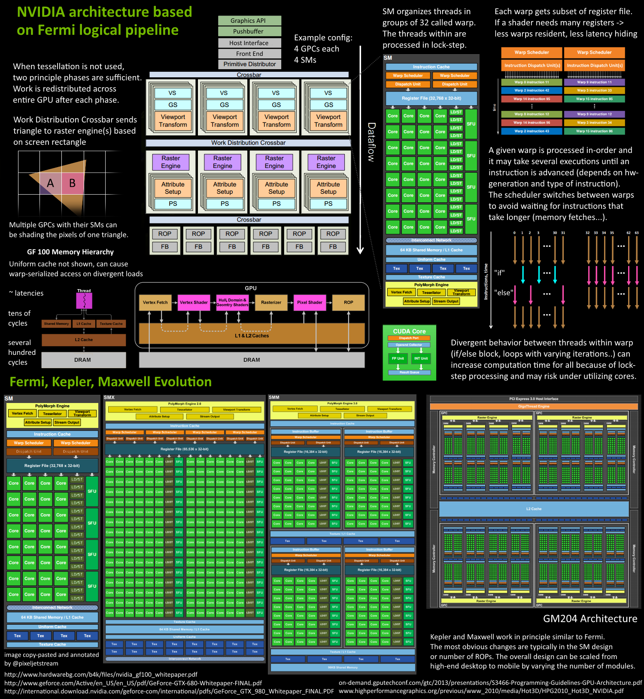

### 硬件架构



一个SM(Streaming Multiprocessor)里有多个SP(Streaming Processor)，也叫CUDA core，一个SP执行一个线程

### 编程模型


多个thread组成一个block，多个block组成一个grid

thread级并行、block级并行、流并行(grid级)

##### 变量内存空间标识符

* `__device__` 表示存放在device的变量，如果之后不跟下面三个标识符，说明放在global memory中，可被grid中所有thread访问
* `__constant__` 表示存放在constant memory中的常量，可被grid中所有thread访问
* `__shared__` 表示存放在一个block中shared memory内的变量，只能被该block内所有thread访问
* `__managed__` 没太看懂先放着

##### 函数执行空间标识符

* `__global__` 表示kernel函数，由host调用后在device上执行，返回void类型，不能是类的成员函数，异步执行，可能先于device执行完返回。调用形式如下

  ```C++
  Func<<<Dg, Db, Ns, S>>>(parameter);
  // Dg for dim of grid(how many blocks)
  // Db for dim of block(how many threads)
  // Ns for size of shared memory
  // S for stream number
  ```

* `__device__` 仅能被device调用并在device上执行

* `__host__` 仅能被host调用并在host上执行，可省略

### 基本算法

##### 规约(reduce)

* 输入为一个数组S和操作op，op满足二值性、交换律、结合律
* 输出为对S中所有数据进行op后的结果

以求和为例

阶段一计算每个block中的部分和

```c++
__global__ void reduce(float *d_sum,float*d_data) {
  extern __shared__ float temp[];
 	int tid = threadIdx.x;
  temp[tid] = d_data[tid+blockIdx.x*blockDim.x];
  for (int d = blockDim.x>>1; d >= 1; d >>= 1) {
    __syncthreads();
    if (tid < d)
      temp[tid] += temp[tid+d];
  }
  if (tid == 0)
    d_sum[blockIdx.x] = temp[0];
}
```

阶段二将所有block中的部分和相加，可以将block中数据传回host求和，也可用atomicAdd

##### 扫描(scan)

* 输入为一个数组S和操作op，op满足二值性、交换律、结合律
* 输出为一个数组O，op为+时$O_i=\Sigma_{j<i}S_j$

1. 串行算法

   ```c++
   int acc = identity	// 单位元
   for (int i=0; i<S.length(); i++) {
     acc += S[i];
     O[i] = acc;
   }
   ```

2. Hillis-Steele算法

   

   ```c++
   __global__ void scan(float *d_data) {
     extern __shared__ float temp[];
     int tid = threadIdx.x;
     temp[tid] = d_data[tid+blockIdx.x*blockDim.x];
     for (int d = 1; d < blockDim.x; d <<= 1) {
       __syncthreads();
       if (tid >= d)
         temp[tid] += temp[tid-d];
     }
   }
   ```

   

3. Blelloch算法

